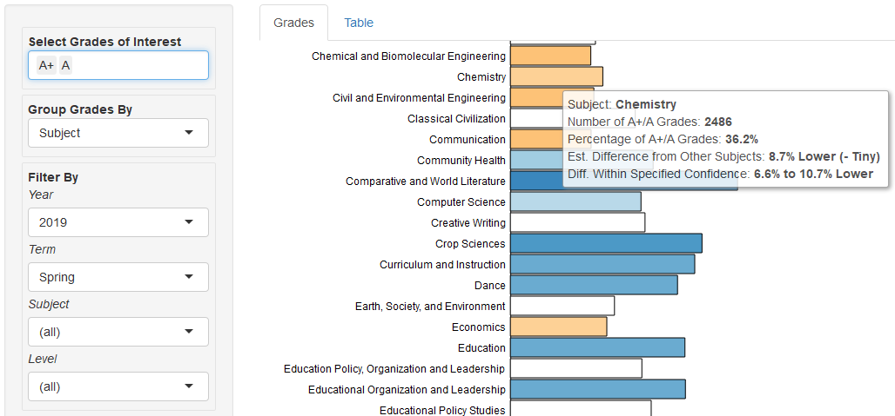

# The BI Guardrails Project
### *Using inferential statistics to make charts more useful*
Part 1 of ?: Percentage Bar Charts
----------------------------------

[Click](https://tuohybuoy.shinyapps.io/uiuc_grade_explorer_with_inferential_guardrails) to interact with the current application at rstudio.shinyapps.io.

## Intro

By themselves, percentage bar charts are handy for comparing groups of differing size. For example, if Reed Richards teaches 100 students and Doctor Doom teaches 500, a percentage bar chart can easily show that Richards awards As to 80% of his students while Doom awards only 20% As:

But what if Reed Richards has only 5, 10 or 20 students instead of 100? When is the number too small to be meaningful for comparing the two instructors? And if a comparison is still meaningful, is the difference significant if Doom becomes generous and awards 75% As compared to Richards' 80%?

This application uses inferential statistics to help address these questions. Hopefully, using it requires little to no knowledge of statistics at all. The results look something like this:

This is a simple example. In reality, we want to compare dozens or hundreds of instructors or courses.

With those volumes, it would certainly be useful to have statistical backup when gauging whether and how a course differs from the others. It would be even more useful to focus on differences that meet a particular threshold of certainty.

The Guardrails app attempts to meet that need.

## The Pieces

## The Dataset

For a demonstration, the application uses the [University of Illinois GPA Dataset](https://github.com/wadefagen/datasets/tree/master/gpa) compiled by Prof. Wade Fagen-Ulmschneider, and used here with his kind permission.

The data summarizes grades awarded at the Champaign-Urbana campus of the University of Illinois from 2010 through 2018. Please see the end of this document for information and descriptive statistics.

## Usage

### Examples

What course subjects are significantly more (or less) likely to award As (or Fs) than the others?

*Accountancy seemed modestly less likely to award As and A+s than other subjects. in the Fall 2018 semester.*

If a subject awards significantly more As, is it more or less likely to award significantly more Fs?

*Accountancy was also marginally less likely to award Fs than other subjects.*

* Within a given subject, which course levels (100, 200, 300, etc.) differ significantly?
  * How do different subjects compare in terms of As awarded by level?
* Within a given subject and level, how do individual courses or instructors compare?
* For a given subject and level, has there been grade inflation over time?
* What happens when we raise or lower the certainty thresholds?

### Example Walkthrough

### Controls and Colors

## Details

### The [University of Illinois GPA Dataset](https://github.com/wadefagen/datasets/tree/master/gpa)

This dataset was provided to meet a number of FOIA requests. It summarizes grades earned in courses of more than 20 students where not all students earned the same grade. Smaller courses and uniformly-graded courses were excluded for privacy reasons.

The dataset contains 2,583,054 grades awarded over nine years in 3,795 unique courses and 161 subjects. These courses were taught by 7,273 unique instructors (unique by name).

By year, grade totals range from 152,303 (2012) to 414,919 (2011).

For any given course in an academic term, grade counts range from 21 to 2,403.

Letter grades range from A+ to F, plus "W" for students who withdrew from a course after official drop deadline.

Note: "Year" in the dataset refers to calendar year, not academic year.

### App Controls

### Statistics

### Handy Links

[The UIUC Course Catalog](https://courses.illinois.edu/)