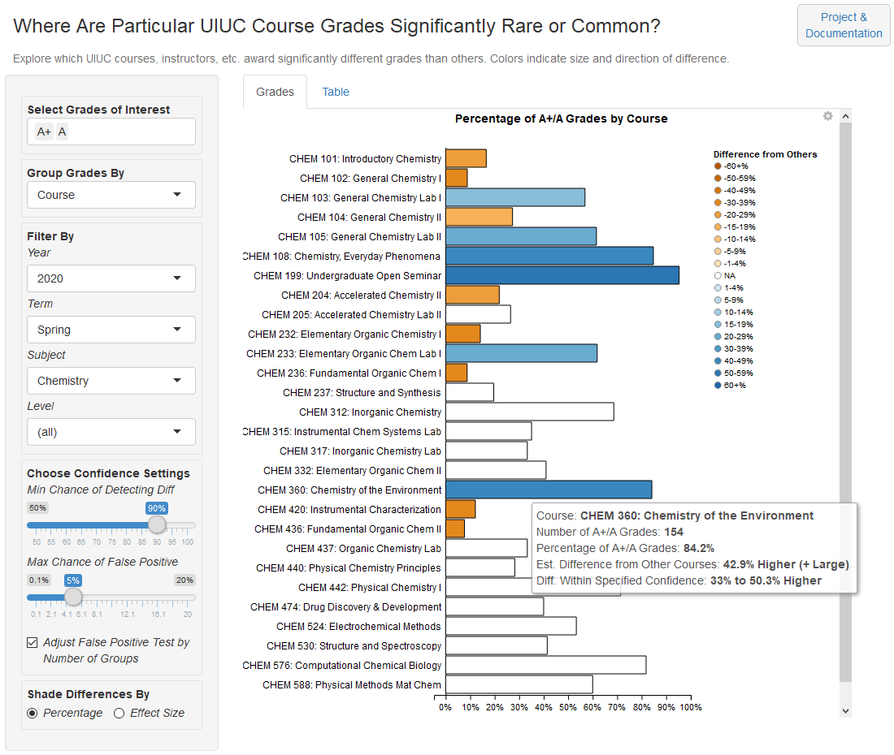
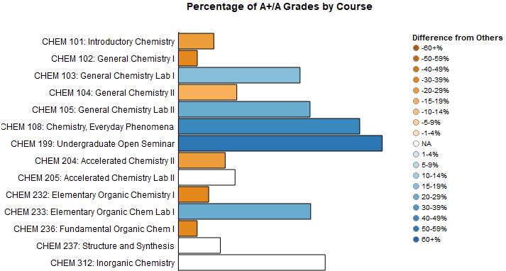
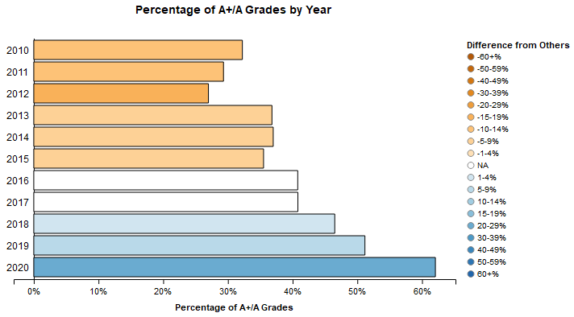
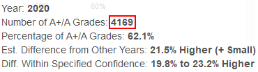

# The BI Guardrails Project
### *Harnessing inferential statistics to make charts more useful*
Part 1 of ?: The Percentage Bar Chart Tool
----------------------------------

[Interact](https://tuohybuoy.shinyapps.io/uiuc_grade_explorer_with_inferential_guardrails) with the current Percentage Bar Chart Tool at [shinyapps.io](https://www.shinyapps.io).

## Intro

### Why This Project?

The strength of charts can also be their weakness. By themselves, charts are powerful tools for summarizing large amounts of data. However, the audience is often left to determine what conclusions to draw from the chart. This is especially true with exploratory charts, where the designer hasn't stated any conclusions.

With a bar chart, audiences have to decide whether each bar is "different enough" from its neighbors to be interesting. This leans heavily on the audience's gut feelings. Arguably, this is the opposite of the desired goal when using data to aid decisionmaking.

Take the percentage bar chart. It's a useful tool for comparing proportions between groups of different sizes. Here's an example that compares how likely three instructors are to award A grades. Prof. Richards gives As to 50 out of 100 students, Dr. Doom gives As to 150 out of 500 students, and Mr. Kent gives As to 8 out of 10 students:

It looks obvious that Prof. Richards is more likely to award As than Dr. Doom. 50% is certainly a higher proportion than 30%. But it looks even more obvious that Mr. Kent awards more As than either of them. The chart may be misleading us on Kent, since it doesn't indicate that the high percentage is based on a low number of grades.

Workarounds exist, such as shading or setting bar thickness by the number of students for each instructor. However, they don't address the core issue that it's up to viewers to determine what differences are likely to be real.

### Inferential Statistics to the Rescue

Returning to our toy example, an improved chart might look like this:

It looks more apparent that Richards is significantly more likely to award As than Doom. The color scale gives some idea of how statistically different they are. And Kent, with a higher proportion of As than either of them, is grayed out due to lack of sufficient grades to draw firm conclusions from.

The second chart draws on statistical techniques to help pinpoint differences that are more likely to be meaningful. Those same techniques can give insight into how big or small a difference is likely to be. Even better, they allow a viewer to choose cutoffs for the level of certainty desired.

The Percentage Bar Chart Tool uses four closely-related attributes to make these determinations:
* *Sample size:* how many students does an instructor or group of instructors have?
* *Effect size:* how big or small is the grade difference between one instructor and others?
* *Statistical Significance:* if two instructors award grades essentially the same way, how likely is it that we'll see a grade sample large enough to lead us to the opposite conclusion? The typically-applied cutoff is 5%.
* *Statistical Power:* if an instructor has N students, what's the minimum chance that we could successfully identify a real grade difference of a certain size? Typical cutoffs for this likelihood are 80%, 90% and 95%.

(A rule of thumb: the smaller the difference between instructors, the more grades are required to identify the difference with a high degree of certainty).

Starting with the percentages and sample sizes, the Percentage Bar Chart Tool calculates apparent differences in the form of effect sizes. Then the application highlights only those differences that meet selected thresholds for statistical significance and power. That is, the tool highlights those differences that are at least as likely to be genuine as the cutoffs demand.

We should note that statistical significance isn't the same as real-world significance. A 1% difference in As awarded might be real, but it's probably not meaningful. However, the tool labels differences as *Large*, *Medium*, *Small* or *Tiny* to help the viewer draw real-world conclusions. In addition, tooltips show the range that the "real" difference is likely to fall within. 

For more details about the statistical tests employed, see [The Statistics](#the-statistics) below.

Beyond the simple 3-instructor comparison above, the Percentage Bar Chart Tool can compare dozens or hundreds of instructors or courses. This makes it potentially useful even for subject matter experts, who might otherwise be hard-pressed to digest this volume of information.

## The Tool

### Intro

Here's what the Percentage Bar Chart Tool looks like:

*Examining differences in As awarded in different Chemistry courses in Spring 2020*

The tool uses a single dataset: the [University of Illinois GPA Dataset](https://github.com/wadefagen/datasets/tree/master/gpa) compiled by Prof. Wade Fagen-Ulmschneider, used here with his kind permission.

The data summarizes letter grades awarded at the [Champaign-Urbana campus of the University of Illinois](https://www.illinois.edu/) from spring semester 2010 through spring 2021. Please see [below](#the-university-of-illinois-gpa-dataset) for more information and descriptive statistics.

### Use Cases

The tool can help investigate questions like these:
* Does Chemistry award significantly fewer grades than other subjects?
* If a subject awards fewer As, does it necessarily award more Ds and Fs?
* Within Chemistry, do 100-level or 200-level courses award more As than average?
* Has Chemistry experienced significant grade inflation over time?

Any Business Intelligence tool can help explore these questions. The Percentage Bar Chart adds value by indicating the size of differences that are likely to be non-random within a specified degree of confidence. This helps users focus on the differences that are more likely to be meaningful.

### Usage

1) First select the course grades to explore. Grades range from A+ to F, with "W" indicating course withdrawal.

2) Choose how to group the grades: by instructor, course, subject, level, or year. For example, choose "Course" to compare individual courses.

3) Filter the results to focus on particular years, terms, subjects or course levels. For example, choose Subject "Chemistry" or "Sociology" to focus on those topics, and choose Level "100" to focus on Freshman-level courses.

4) Set *Min Chance of Detecting Diff* to the minimum desired confidence for detecting "true" grade differences. This corresponds to the notion of statistical power described above. Typical confidence cutoffs are 80%, 90% and 95%. The higher the cutoff, the more the tool focuses on larger groups with larger differences that are highly likely to be real.

5) Choose *Max Chance of False Positive*, the maximum acceptable chance that a random difference may appear significant when a "true" difference does not exist. This corresponds to the notion of statistical significance. The typical cutoff is 5%, and often lower. The lower the significance cutoff, the more the tool focuses on larger groups with larger differences that are less likely to be artifacts of random chance.

Normally, leave the *Adjust False Positive Test by Number of Groups* box checked. This adjusts the significance cutoff downward according to the number of groups (courses/instructors/etc.) in the chart. The goal is to reduce the chance that any of the multiple comparisons produces a false positive.

6) Choose whether to shade interesting differences by a) the difference in the percentage of selected grades or b) the statistical effect size.

"Percentage" indicates a group's difference in percent grades from all other groups in the chart combined. "Effect Size" colors groups according to conventional cutoffs for small, medium and large effect sizes, like so:

7) View the results. The darker orange a group is, the less likely it is to award the selected grades than other groups in the chart. Blue indicates higher likelihood of awarding the selected grades. White ("NA") indicates groups where the difference and/or sample size don't meet the selected confidence threshold.

8) Hover over each group to view its details: the number and percent of selected grades awarded, plus the size and range of any detected difference from other groups in the chart.

The "Est. Difference from" row gives a point estimate for the "true" difference between a group's grades and those of all other groups. In addition, the row shows an indicator for effect size and direction, such as "+ Medium".

"Diff. Within Specified Confidence" indicates the likely range that contains the "true" difference, given the *Max Chance of False Positive* setting from step 5. Lowering the chance of a false positive gives a larger range.

### Examples

1) Beginning at a high level: which course subjects were significantly more (or less) likely to award A/A+ grades in Spring 2019?

*Chemistry was marginally less likely to award A and A+ grades than other subjects.*

2) If Chemistry awarded significantly fewer As than other subjects in Spring 2019, was it likely to award significantly more Ds and Fs?

*Chemistry was indeed marginally more likely to award D and F grades.*

3) Which Chemistry levels (100, 200, etc.) awarded significantly more high grades or low grades in Spring 2019?

*100-level Chemistry courses were overall more likely to award As than other levels.*

*Interestingly, 100-level Chem courses were also slightly more likely to award low grades than other levels.*

4) Drill down into 100-level Chemistry courses. What are the patterns of high and low grades?

*General Chemistry I and II awarded relatively few As, but their paired laboratory courses awarded significantly more As.*

*The pattern is reversed for D and F grades.*

### Timeless Caveat

As with any data analysis, consider the context before interpreting results. To illustrate, let's look at Computer Science grades from Spring 2020, the first semester that higher education dealt with COVID-19.

Suppose we wanted to determine whether COVID led to grade inflation in Computer Science courses. At first glance, it looks as though this might have been the case:

There appears to be a significant jump in the percentage of As awarded in 2020, apart from an increasing trend in previous spring semesters.

Let's take a closer look at the number of As awarded in Spring 2020:

And compare to Spring 2019:

There were almost 600 fewer As awarded in 2020, while they constituted a higher percentage of total letter grades. This must mean there are even fewer A-,B+ and below grades in 2020 compared to 2019. A quick check with the BI Guardrails Tool shows that's the case: 2548 such grades in 2020 compared to 4528 in 2019. What is going on?

It's true that instructors were encouraged to be more accommodating as students and colleagues dealt with the effects of COVID, lockdown and hastily-improvised online instruction. There's more to the story, though.

Students were also given unprecedented leeway to opt for credit/no-credit grades instead of standard letter grades like A and B. Students were even free to opt for credit/no-credit in their major courses, which had never been allowed before.

Since the U of I GPA Dataset only includes letter grades, there's no information on credit/no-credit frequency. This means we can't completely gauge the effect of COVID on course grades. However, we can say that the 2020 students who opted to keep letter grades were more likely to earn the highest ones.

## Project Details

### The [University of Illinois GPA Dataset](https://github.com/wadefagen/datasets/tree/master/gpa)

As mentioned above, the data summarizes grades awarded at the [Champaign-Urbana campus of the University of Illinois](https://www.illinois.edu/) from spring semester 2010 through spring 2021. Grades are summarized by semester, course, and primary instructor name.

This dataset was provided to meet a number of FOIA requests. It includes grades from courses of more than 20 students where not all students earned the same grade. Smaller courses and uniformly-graded courses were excluded for privacy reasons.

The current dataset contains 3,383,346 grades awarded over 12 years in 5,826 unique courses and 166 subjects. These courses were taught by 8,425 unique instructors (unique by name).

By year, grade totals range from 148,352 (2021) to 414,919 (2011).

*Note:* the grade counts for the following semesters are much larger or smaller than the counts in neighboring semesters: Summer 2011, Spring 2012, Summer 2015, Summer 2016 and Winter 2020. Use caution when interpreting results from those semesters. In particular, Winter 2020 seems to be a duplicate of Summer 2020.

For any single course in a semester, grade counts range from 21 to 2,403.

Letter grades range from A+ to F, plus "W" for students who withdrew from a course after official drop deadline.

*Note:* "Year" in the dataset refers to calendar year, not academic year. At the UIUC campus, academic years begin in fall and end the following summer.

### The Interface

The tool is written in R and uses the Shiny package for interactivity.

The functionality would have been orders of magnitude faster to implement in Tableau, but unfortunately only commercial Tableau Desktop supports the R or Python scripts needed for statistical inference tests. Microsoft Power BI does support using R to create computed columns, but those columns are at the detail level of the base data -- not at the level of a rollup, as would be required for the Percentage Bar Chart Tool.

### The Statistics

#### Test Type

For each group in a chart, the tool runs an [exact binomial test](https://en.wikipedia.org/wiki/Binomial_test) to compare the group's proportion of selected grades against the proportion in all other groups in the chart.

For example, if the chart shows As earned in Chemistry courses: the tool compares the percentage of As in CHEM 101 against the percentage in CHEM 102 through 590 combined. The tool then compares CHEM 102 against CHEM 101 plus 103 - 590 combined, and so on.

The binomial test is convenient because it gives exact p-values for groups with small numbers of grades, unlike a chi-square test which uses a theoretical distribution. Against this dataset, the binomial test runs about as fast as a chi-square test -- so there's no sacrifice in speed.

#### Approach

For each group, the tool considers all other groups as the "population" rather than constructing a contingency table of the current group vs. all others. That is, the tool runs a series of one-sample tests.

It takes this approach because the number of grades in other groups almost always overwhelms the number in the current group, and that degree of imbalance would mute many interesting differences. 

The tool conducts two-tailed tests because it considers higher and lower grade proportions equally likely.

#### Statistical Significance 

By default, the tool performs a [Bonferroni correction](https://en.wikipedia.org/wiki/Bonferroni_correction) to guard against the occurrence of false positives across multiple tests. This is controlled by the *Adjust False Positive Test by Number of Groups* checkbox.

The Bonferroni correction is considered overly conservative when the multiple tests are related, as they are here. However, it is simple and convenient.

#### Statistical Power

As far as identifying "true positives" goes, the tool runs into a basic problem. Normally, researchers conduct power analysis to determine how much sample data they require to detect an effect of an anticipated size. This tool doesn't have that luxury, since course grades have already been awarded, meaning the sample sizes are already fixed. Furthermore, the tool looks for effects of any size, not an anticipated size.

Instead, the tool performs a kind of post-hoc power analysis. For each group in a chart, the tool computes the smallest "true" effect that could be detected at or above the specified power threshold. Then, if the group shows an effect of at least that size, the effect is displayed onscreen.

One contrary argument is that using observed power is just a different way of using p-values. A more fundamental argument is that controlling for Type II error is only meaningful before any data is collected, which is the only point it's acceptable to assume that the null hypothesis is false.

On the other hand, since power analysis tests sufficiency of sample size, it's indispensable to this tool.

#### Effect Size

The tool computes effect sizes for two proportions. It classifies differences as small, medium or large according to Jacob Cohen's conventions for these effect sizes.
* Small: effect sizes of absolute value in the range [0.2, 0.5)
* Medium: [0.5, 0.8)
* Large: 0.8 and above

"Tiny" is reserved for statistically significant effect sizes below 0.2. "NA" indicates tests with nonsignificant results, or selections with only one group where no comparison is possible.

#### Confidence Interval

The tooltips include confidence intervals for each group's degree of difference from other groups in the chart. Example: "Difference Range: 14.5% to 37.3% Higher".

These are based on the binomial test's confidence interval for the "true" proportion of selected grades in the group, minus the measured proportion of selected grades in other groups. The "other groups" proportion is treated as exact, since the tool treats other groups as a population rather than a sample. This simplifies the calculation but sacrifices potential nuance.

The *Max Chance of False Positive* slider feeds the calculation of confidence intervals.

## Left To Do

It might be shorter to list the work that's *not* left to do. Nevertheless, here are some changes that would make the tool more useful.

### Bigger Changes

#### Enable Uploading of Custom Data, Groupings and Measures

Not everyone is interested in grades awarded by a midwestern US university, but everyone has some type of data they're interested in. The Percentage Bar Chart Tool might offer useful functionality for interpretation of that data.

#### Enable Drilldown

If a viewer is curious about the differences between certain courses, it would be handy to be able to view the instructors for just those courses and get a sense of their habits in awarding grades. It would also be handy to look at grading patterns in those courses over time and check whether they might be related to changes in the instructors teaching the courses.

This could be accomplished with a dashboard or with predictive models (given sufficient data).

#### Incorporate the UIUC Course Catalog and Instructor CVs

It would be helpful to know whether course characteristics or instructor backgrounds were driving some of the grading differences.

Simple integration would just mean linking to the course catalog and instructor websites. More complex integration would include building predictive models based on course and instructor characteristics to estimate the "proportion of difference explained" by those characteristics.

#### Add Option for A Priori Power Analysis

As noted [above](#statistical-power), the tool's use of post-hoc power analysis is flawed, perhaps fundamentally flawed. A sounder option would be to prompt the user for a desired effect size, then to compute the minimum required sample size. The tool would then test only the groups above that size threshold -- and only display whether the *anticipated* effect size was found, rather than any resulting effect size.

This approach is still imperfect for the unavoidable reason that the course grades have already been awarded. The approach would also make the app more unwieldy and less general-purpose.

### Smaller Changes

#### Filter by Primary Instructor

The full instructor list is too extensive for a single dropdown control. However, when other filters are applied, a context-sensitive instructor list could be useful. For example, when focusing on Chemistry courses, it could help focus further on courses taught by specific Chemistry instructors. 

#### Dynamically Populate Filter Controls Based on Current Selection

The filter controls currently show all values in the dataset, which makes it easy to choose filter combinations that match no data. For example, it's possible to filter the data to Fall 2019 courses and get an empty chart because no data is available.

The remedy is to populate the filter dropdowns dynamically with selections that match at least one data point. Business-intelligence tools like Tableau can do this automatically, but R and Shiny require custom code to make this work.

## Handy Links

[Online Interactive Percentage Bar Chart Tool](https://tuohybuoy.shinyapps.io/uiuc_grade_explorer_with_inferential_guardrails)

[The UIUC Course Catalog](https://courses.illinois.edu/)