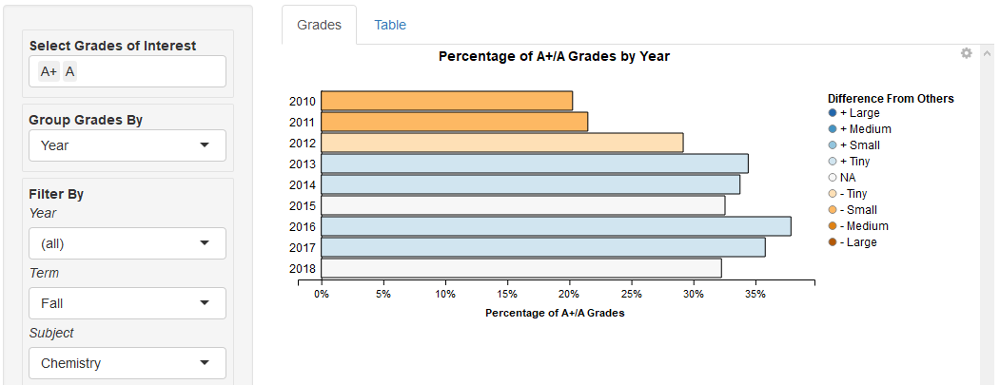

# The BI Guardrails Project
### *Harnessing inferential statistics to make charts more useful*
Part 1 of ?: Percentage Bar Charts
----------------------------------

[Interact](https://tuohybuoy.shinyapps.io/uiuc_grade_explorer_with_inferential_guardrails) with the current application at [rstudio.shinyapps.io](https://rstudio.shinyapps.io).

## Intro

### Why This Project?

The strength of charts can also be their weakness. By themselves, charts are powerful tools for summarizing large amounts of data. However, the audience is often left to determine what conclusions to draw from the chart. This is especially true with exploratory charts, where the designer hasn't stated any conclusions.

With a bar chart, audiences have to decide whether one bar is sufficiently long compared to its neighbors to be "different" from them. This leans heavily on the audience's gut feelings. Arguably, this is the opposite of the desired goal when using data to aid decisionmaking.

Take the percentage bar chart. It's a useful tool for comparing proportions between groups of differing size. Here's an example where Prof. Richards gives As to 50 out of 100 students, and Dr. Doom gives As to 150 out of 500 students:

It looks obvious that Prof. Richards is more likely to award As. 50% is certainly a higher proportion than 30%. But what if Richards only has ten students, or six? The chart doesn't help determine whether "50% vs. 30%" is still likely to be meaningful, or just a product of random chance. In fact, the chart actively impedes efforts to determine this by looking exactly like the case with 100 students vs. 500:

Workarounds exist, such as shading or setting bar thickness by the number of students for each instructor. However, they don't address the core issue that it's up to viewers to determine what differences are likely to be real.

### Inferential Statistics to the Rescue

Statistical techniques can help pinpoint differences that are more likely to be meaningful. Those same techniques can give insight into how big or small a difference is likely to be. Even better, they allow a viewer to choose cutoffs for the level of certainty they desire.

This Percentage Bar Chart Guardrails tool uses four closely-related attributes to make this determination:
* *Sample size:* how many students does an instructor or group of instructors have?
* *Effect size:* how big or small is the difference between one instructor and others?
* *Significance:* how likely is the difference to be a false positive? The typically-applied cutoff is 5%.
* *Power:* if an instructor has N students, what's the minimum chance that we could successfully identify a real difference from the other instructors, where the difference is a certain size? Typical cutoffs are 80%, 90% and 95%.

A rule of thumb: the smaller the difference between instructors, the more grades are required to identify the difference with a high degree of certainty.

Starting with the percentages and sample sizes, the Percentage Bar Chart Guardrails tool calculates apparent differences in the form of effect sizes. Finally, the application highlights only those differences that meet selected thresholds for statistical significance and power -- that is, those differences that are at least as likely to be real as the cutoffs demand.

We should note that statistical significance isn't the same as real-world significance. A 1% difference in grades awarded might be real, but it's probably not meaningful. However, the tool labels differences as Large, Medium, Small or Tiny to help the viewer draw real-world conclusions. In addition, tooltips show the range that the "real" difference is likely to fall within. 

For more details about the statistical tests employed, see [The Statistics](#the-statistics) below.

A simple version of such a chart might look like this:

Past this start point, the Percentage Bar Chart tool can compare dozens or hundreds of instructors or courses. This makes it potentially useful even for subject matter experts, who might otherwise be hard-pressed to digest this volume of information.

## The Tool

### Intro

Here's what the Percentage Bar Chart tool looks like:

*Examining differences in As awarded by different Chemistry instructors in Spring 2019*

The tool uses a single dataset: the [University of Illinois GPA Dataset](https://github.com/wadefagen/datasets/tree/master/gpa) compiled by Prof. Wade Fagen-Ulmschneider, used here with his kind permission.

The data summarizes grades awarded at the [Champaign-Urbana campus of the University of Illinois](https://www.illinois.edu/) from spring semester 2010 through summer 2019. Please see the end of this document for more information and descriptive statistics.

### Use Cases

The tool can help investigate questions like these:
* Does Sociology award significantly more As than other subjects, and does Chemistry award significantly less?
* If a subject awards fewer As, does it necessarily award more Ds and Fs?
* Within Chemistry, do 100-level or 200-level courses award more As than average?
* Has there been significant grade inflation over time within Chemistry courses?

Any Business Intelligence tool can help explore these questions. The Percentage Bar Chart adds value by indicating the size of differences that are likely to be nonrandom within a specified range of confidence. This helps users focus on the differences that are more likely to be meaningful.

### Steps

1) First select the course grades to explore. Grades range from A+ to F, with "W" indicating course withdrawal.

2) Choose how to group the grades: by instructor, course, subject, level, or year. For example, choose "Primary Instructor" to compare individual instructors.

3) Filter the results to focus on particular years, terms, subjects or course levels. For example, choose Subject "Chemistry" or "Sociology" to focus on those topics.

4) Choose *Min Chance of Detecting Diff*, the minimum desired confidence for detecting "true" grade differences. This corresponds to the notion of statistical power described above. Typical confidence cutoffs are 80%, 90% and 95%. The higher the cutoff, the more the tool focuses on larger groupings and larger differences that are highly likely to be real.

5) Choose *Max Chance of False Positive*, the maximum likelihood that a given difference is due to random chance when a "true" difference does not exist. This corresponds to the notion of statistical significance. The typical cutoff is 5%, and often lower. The lower the significance cutoff, the more the tool focuses on larger groupings and larger differences that are less likely to be random.

Normally, leave the *Adjust False Positive Test by Number of Groups* box checked. This adjusts the significance cutoff downward according to the number of groups (courses/instructors/etc.) in the chart. The goal is to reduce the chance that any of the multiple comparisons produces a false positive.

6) View the results. The darker orange a group is, the less likely it is to award the selected grades than other groups in the chart. Blue indicates higher likelihood of awarding the selected grades.

Hover over each group to view its details: the number and percent of selected grades awarded, plus the size and range of any detected difference from other groups in the chart.

### Examples

1) What course subjects are significantly more (or less) likely to award As (or Fs) than the others?

*Accountancy seemed marginally less likely to award As and A+s than other subjects. in the Fall 2018 semester.*

2) If a subject awards significantly more As, is it more or less likely to award significantly more Fs?

*Accountancy was also marginally less likely to award Fs than other subjects.*

3) Do Chemistry courses appear to have experienced grade inflation over time?

*Overall, Chemistry courses experienced a significant increase in the number of As and A+s awarded in fall semesters.*

4) Which instructors of 100-level Chemistry courses award significantly more or fewer As than the rest?

*Left as an exercise for the reader!*

## Project Details

### The [University of Illinois GPA Dataset](https://github.com/wadefagen/datasets/tree/master/gpa)

As mentioned above, the data summarizes grades awarded at the [Champaign-Urbana campus of the University of Illinois](https://www.illinois.edu/) from spring semester 2010 through summer 2019. Grades are summarized by semester, course, and primary instructor name.

This dataset was provided to meet a number of FOIA requests. It includes grades from courses of more than 20 students where not all students earned the same grade. Smaller courses and uniformly-graded courses were excluded for privacy reasons.

The current dataset contains 2,710,856 grades awarded over ten years in 5,138 unique courses and 153 subjects. These courses were taught by 7,394 unique instructors (unique by name).

By year, grade totals range from 150,814 (2012) to 409,018 (2011). Note that the grade counts for the following semesters are much larger or smaller than the counts in neighboring semesters: Summer 2011, Spring 2012, Summer 2015 and Summer 2016. Use caution when interpreting results from those semesters.

For any single course in a semester, grade counts range from 21 to 2,403.

Letter grades range from A+ to F, plus "W" for students who withdrew from a course after official drop deadline.

Note: "Year" in the dataset refers to calendar year, not academic year. At the UIUC campus, academic years begin in fall and end the following summer.

### The Interface

The tool is written in R and uses the base Shiny package for interactivity.

The functionality would have been orders of magnitude faster to implement in Tableau, but unfortunately only commercial Tableau Desktop supports the R or Python scripts needed for statistical inference tests. Microsoft Power BI does support using R to create computed columns, but those columns are at the detail level of the base data -- not at the level of a rollup, as would be required for the Percentage Bar Chart tool.

### The Statistics

Normally, researchers employ inferential statistical tests to help construct experiments and interpret results. Unlike most researchers, the Percentage Bar Chart tool has no prior expectations about what its test results might be. This creates certain drawbacks. (**EDIT**)

For each group in a chart, the tool runs an [exact binomial test](https://en.wikipedia.org/wiki/Binomial_test) to compare the group's proportion of selected grades against the proportion in all other groups in the chart.

For example, if the chart shows As earned in each Chemistry course: the tool compares the percentage of As in CHEM 101 against the percentage in CHEM 102 through 584 combined. The tool then compares CHEM 102 against CHEM 101 plus 103 - 584 combined, and so on.

The binomial test is convenient because it gives exact p-values for groups with small numbers of grades, unlike a parametric chi-square test. Against this dataset, the binomial test runs about as fast as a chi-square test -- so there's no sacrifice in speed.

For each group, the tool considers all other groups as the "population" rather than constructing a contingency table of the current group vs. all others. This is because the number of grades in other groups almost always overwhelms the number in the current group, and that degree of imbalance would mute many interesting differences. 

The tool uses a two-tailed test because it considers higher and lower grade proportions equally likely.

By default, the tool performs a Bonferroni correction to guard against the occurrence of one or more false positives across multiple tests. This is controlled by the *Adjust False Positive Test by Number of Groups* checkbox. The Bonferroni test is sometimes considered overly conservative, but it is simple and convenient.

As far as identifying "true positives" goes, the tool runs into a basic problem. Normally, researchers conduct power analysis to determine how much sample data they require to detect an effect of a certain size. This tool doesn't have that luxury, since course grades have already been awarded. Furthermore, the tool looks for effects of any size, not an anticipated size.

Thus the tool performs a kind of post-hoc power analysis. For each group in a chart, the tool computes the smallest effect that could be detected at or above the specified confidence level. Then, if the group shows an effect of at least that size, it's displayed onscreen.

This may not be as kosher as I would like. One contrary argument is that post-hoc power analysis is just a different way of showing p-values. A more fundamental argument is that controlling for Type II error is only meaningful before any data is collected. If this is true, at least the Percentage Bar Chart tool is far from alone in the way is misuses power analysis.

The tool classifies differences as small, medium or large depending on Jacob Cohen's conventions for effect sizes in exact tests of proportions.
* Small: effect sizes of absolute value in the range [0.2, 0.5)
* Medium: [0.5, 0.8)
* Large: 0.8 and above

"Tiny" is reserved for statistically significant effect sizes below 0.2. "NA" indicates tests with nonsignificant results, or selections with only one group where no comparison is possible.

### Handy Links

[The UIUC Course Catalog](https://courses.illinois.edu/)

## Left To Do

